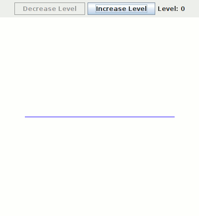

# Fractal

This framework allows you to easily create any fractal that comes up to your (or your friend) imagination.

It comes with two examples:
 - [Koch Curve](src/examples/KochCurve.scala)
 - [Koch Snowflake](src/examples/KochSnowflake.scala)

# Example

Here is an animation showing different levels of Koch Curve:



This fractal was created by the following 35 lines of Scala code:
```
package examples

import java.awt.Graphics

import math._

import fractal.Fractal
import util.Point

class KochCurve extends Fractal {
  val name = "Koch Curve"

  def draw(level: Int, g: Graphics, a: Point, b: Point): Unit =
    if (level == 0)
      g.drawLine(round(a.x.toFloat), round(a.y.toFloat), round(b.x.toFloat), round(b.y.toFloat))
    else {
      val c = (a * 2 + b) / 3
      val d = (a + b * 2) / 3
      val e = c + (d - c).rotate(Pi/3)

      draw(level - 1, g, a, c)
      draw(level - 1, g, c, e)
      draw(level - 1, g, e, d)
      draw(level - 1, g, d, b)
    }

  override def paintComponent(g: Graphics) = {
    super.paintComponent(g)

    val a = Point(getWidth * 1/8, getHeight * 1/2)
    val b = Point(getWidth * 7/8, getHeight * 1/2)

    draw(level, g, a, b)
  }
}
```
